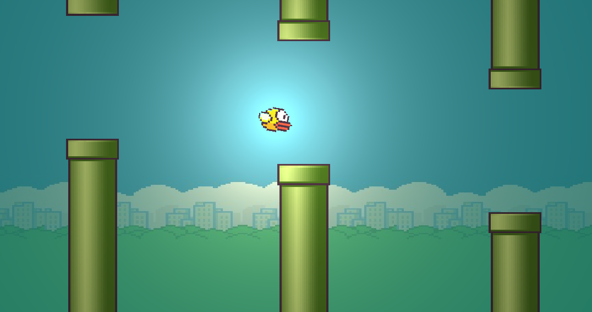

# Flappy Bird

A modern Java 21+ implementation of Flappy Bird using **Project Panama** (Foreign Function & Memory API) with **SDL2** and **OpenGL**.



## Features

- **Java 21** or later (with preview features)
- **Project Panama** FFM API for native SDL2/OpenGL bindings
- **SDL2** for windowing, input, and audio (via SDL2_mixer)
- **OpenGL 3.3** for rendering with custom shaders
- **Cross-platform** support (Windows, Linux, macOS)

## Controls

| Key | Action |
|-----|--------|
| **Space** | Flap / Jump |
| **Enter** | Start game / Play again |
| **M** | Return to menu |
| **Q** | Quit game |

## Prerequisites

- **JDK 21** or later (with preview features)
- **SDL2** runtime library
- **SDL2_mixer** for audio (optional)

### Windows Setup

1. Download **SDL2** and **SDL2_mixer** runtime binaries (DLLs).
2. Add the directory containing the DLLs to your `PATH` environment variable.
   ```powershell
   $env:PATH = "C:\path\to\SDL2\lib\x64;$env:PATH"
   ```

### Linux Setup

```bash
sudo apt install libsdl2-2.0-0 libsdl2-mixer-2.0-0
```

### macOS Setup

```bash
brew install sdl2 sdl2_mixer
```

## Build & Run

### Using Maven

```bash
# Compile
mvn clean compile

# Run
mvn exec:exec
```

### Using IntelliJ IDEA

1. Open project in IntelliJ
2. Set JDK to 21+ with preview features enabled
3. Add VM options: `--enable-preview --enable-native-access=ALL-UNNAMED`
4. Run `game.Main`


## Technologies

- **Java 21+** - Modern Java with preview features
- **Project Panama** - Native interop without JNI
- **SDL2** - Cross-platform windowing and input
- **SDL2_mixer** - Audio playback
- **OpenGL 3.3** - Hardware-accelerated rendering
- **GLSL** - Shader programming


This project is for educational purposes.

